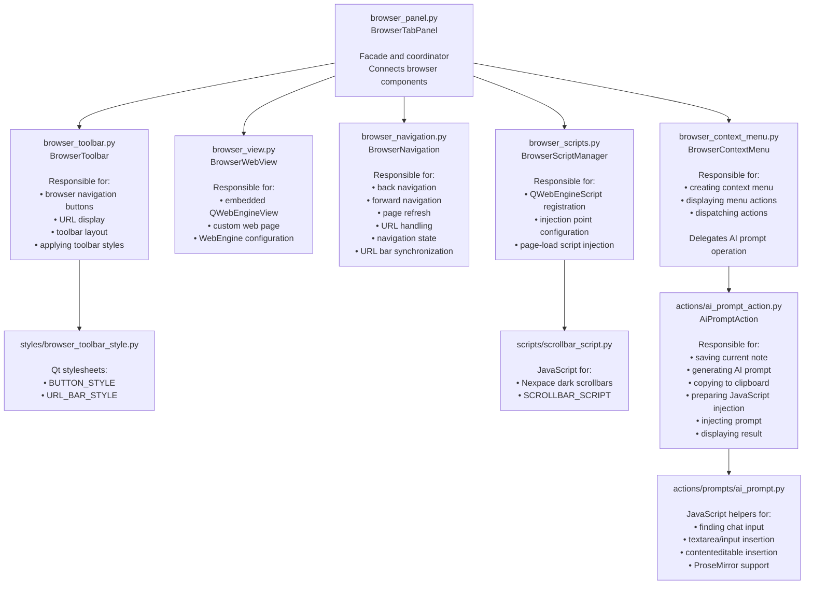

# Browser Architecture

```mermaid
flowchart TD

    BrowserPanel["browser_panel.py<br/>BrowserTabPanel<br/><br/>Facade and coordinator<br/>Connects browser components"]

    Toolbar["browser_toolbar.py<br/>BrowserToolbar<br/><br/>Responsible for:<br/>• browser navigation buttons<br/>• URL display<br/>• toolbar layout<br/>• applying toolbar styles"]

    View["browser_view.py<br/>BrowserWebView<br/><br/>Responsible for:<br/>• embedded QWebEngineView<br/>• custom web page<br/>• WebEngine configuration"]

    Navigation["browser_navigation.py<br/>BrowserNavigation<br/><br/>Responsible for:<br/>• back navigation<br/>• forward navigation<br/>• page refresh<br/>• URL handling<br/>• navigation state<br/>• URL bar synchronization"]

    Scripts["browser_scripts.py<br/>BrowserScriptManager<br/><br/>Responsible for:<br/>• QWebEngineScript registration<br/>• injection point configuration<br/>• page-load script injection"]

    ContextMenu["browser_context_menu.py<br/>BrowserContextMenu<br/><br/>Responsible for:<br/>• creating context menu<br/>• displaying menu actions<br/>• dispatching actions<br/><br/>Delegates AI prompt operation"]

    ToolbarStyle["styles/browser_toolbar_style.py<br/><br/>Qt stylesheets:<br/>• BUTTON_STYLE<br/>• URL_BAR_STYLE"]

    ScrollbarScript["scripts/scrollbar_script.py<br/><br/>JavaScript for:<br/>• Nexpace dark scrollbars<br/>• SCROLLBAR_SCRIPT"]

    AiAction["actions/ai_prompt_action.py<br/>AiPromptAction<br/><br/>Responsible for:<br/>• saving current note<br/>• generating AI prompt<br/>• copying to clipboard<br/>• preparing JavaScript injection<br/>• injecting prompt<br/>• displaying result"]

    PromptScript["actions/prompts/ai_prompt.py<br/><br/>JavaScript helpers for:<br/>• finding chat input<br/>• textarea/input insertion<br/>• contenteditable insertion<br/>• ProseMirror support"]

    BrowserPanel --> Toolbar
    BrowserPanel --> View
    BrowserPanel --> Navigation
    BrowserPanel --> Scripts
    BrowserPanel --> ContextMenu

    Toolbar --> ToolbarStyle
    Scripts --> ScrollbarScript
    ContextMenu --> AiAction
    AiAction --> PromptScript
```
