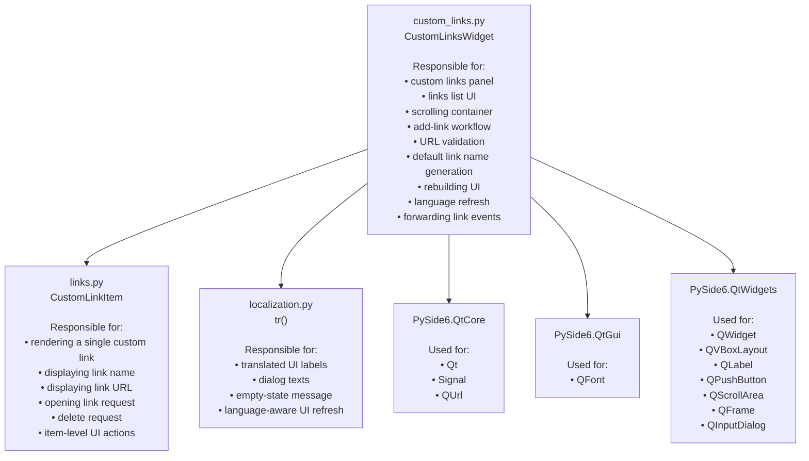

# Custom Links Architecture

```mermaid
flowchart TD

    CustomLinks["custom_links.py<br/>CustomLinksWidget<br/><br/>Responsible for:<br/>• custom links panel<br/>• links list UI<br/>• scrolling container<br/>• add-link workflow<br/>• URL validation<br/>• default link name generation<br/>• rebuilding UI<br/>• language refresh<br/>• forwarding link events"]

    CustomLinkItem["links.py<br/>CustomLinkItem<br/><br/>Responsible for:<br/>• rendering a single custom link<br/>• displaying link name<br/>• displaying link URL<br/>• opening link request<br/>• delete request<br/>• item-level UI actions"]

    Localization["localization.py<br/>tr()<br/><br/>Responsible for:<br/>• translated UI labels<br/>• dialog texts<br/>• empty-state message<br/>• language-aware UI refresh"]

    QtCore["PySide6.QtCore<br/><br/>Used for:<br/>• Qt<br/>• Signal<br/>• QUrl"]

    QtGui["PySide6.QtGui<br/><br/>Used for:<br/>• QFont"]

    QtWidgets["PySide6.QtWidgets<br/><br/>Used for:<br/>• QWidget<br/>• QVBoxLayout<br/>• QLabel<br/>• QPushButton<br/>• QScrollArea<br/>• QFrame<br/>• QInputDialog"]

    CustomLinks --> CustomLinkItem
    CustomLinks --> Localization

    CustomLinks --> QtCore
    CustomLinks --> QtGui
    CustomLinks --> QtWidgets
```
