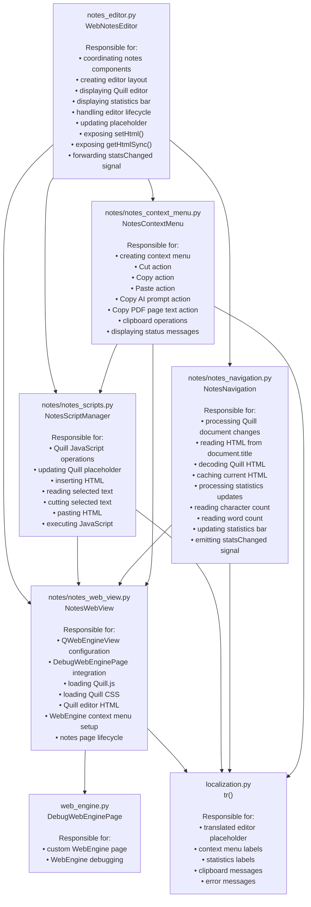

# Notes Editor Architecture

```mermaid
flowchart TD

    NotesEditor["notes_editor.py<br/>WebNotesEditor<br/><br/>Responsible for:<br/>• coordinating notes components<br/>• creating editor layout<br/>• displaying Quill editor<br/>• displaying statistics bar<br/>• handling editor lifecycle<br/>• updating placeholder<br/>• exposing setHtml()<br/>• exposing getHtmlSync()<br/>• forwarding statsChanged signal"]

    NotesWebView["notes/notes_web_view.py<br/>NotesWebView<br/><br/>Responsible for:<br/>• QWebEngineView configuration<br/>• DebugWebEnginePage integration<br/>• loading Quill.js<br/>• loading Quill CSS<br/>• Quill editor HTML<br/>• WebEngine context menu setup<br/>• notes page lifecycle"]

    NotesScripts["notes/notes_scripts.py<br/>NotesScriptManager<br/><br/>Responsible for:<br/>• Quill JavaScript operations<br/>• updating Quill placeholder<br/>• inserting HTML<br/>• reading selected text<br/>• cutting selected text<br/>• pasting HTML<br/>• executing JavaScript"]

    NotesNavigation["notes/notes_navigation.py<br/>NotesNavigation<br/><br/>Responsible for:<br/>• processing Quill document changes<br/>• reading HTML from document.title<br/>• decoding Quill HTML<br/>• caching current HTML<br/>• processing statistics updates<br/>• reading character count<br/>• reading word count<br/>• updating statistics bar<br/>• emitting statsChanged signal"]

    NotesContextMenu["notes/notes_context_menu.py<br/>NotesContextMenu<br/><br/>Responsible for:<br/>• creating context menu<br/>• Cut action<br/>• Copy action<br/>• Paste action<br/>• Copy AI prompt action<br/>• Copy PDF page text action<br/>• clipboard operations<br/>• displaying status messages"]

    Localization["localization.py<br/>tr()<br/><br/>Responsible for:<br/>• translated editor placeholder<br/>• context menu labels<br/>• statistics labels<br/>• clipboard messages<br/>• error messages"]

    DebugWebEngine["web_engine.py<br/>DebugWebEnginePage<br/><br/>Responsible for:<br/>• custom WebEngine page<br/>• WebEngine debugging"]

    NotesEditor --> NotesWebView
    NotesEditor --> NotesScripts
    NotesEditor --> NotesNavigation
    NotesEditor --> NotesContextMenu

    NotesWebView --> DebugWebEngine
    NotesWebView --> Localization

    NotesScripts --> NotesWebView
    NotesScripts --> Localization

    NotesNavigation --> NotesWebView
    NotesNavigation --> Localization

    NotesContextMenu --> NotesWebView
    NotesContextMenu --> NotesScripts
    NotesContextMenu --> Localization
```
