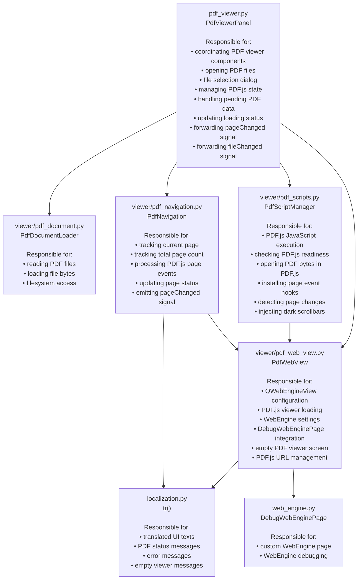

# PDF Viewer Architecture

```mermaid
flowchart TD

    PdfViewer["pdf_viewer.py<br/>PdfViewerPanel<br/><br/>Responsible for:<br/>• coordinating PDF viewer components<br/>• opening PDF files<br/>• file selection dialog<br/>• managing PDF.js state<br/>• handling pending PDF data<br/>• updating loading status<br/>• forwarding pageChanged signal<br/>• forwarding fileChanged signal"]

    PdfDocument["viewer/pdf_document.py<br/>PdfDocumentLoader<br/><br/>Responsible for:<br/>• reading PDF files<br/>• loading file bytes<br/>• filesystem access"]

    PdfNavigation["viewer/pdf_navigation.py<br/>PdfNavigation<br/><br/>Responsible for:<br/>• tracking current page<br/>• tracking total page count<br/>• processing PDF.js page events<br/>• updating page status<br/>• emitting pageChanged signal"]

    PdfScripts["viewer/pdf_scripts.py<br/>PdfScriptManager<br/><br/>Responsible for:<br/>• PDF.js JavaScript execution<br/>• checking PDF.js readiness<br/>• opening PDF bytes in PDF.js<br/>• installing page event hooks<br/>• detecting page changes<br/>• injecting dark scrollbars"]

    PdfWebView["viewer/pdf_web_view.py<br/>PdfWebView<br/><br/>Responsible for:<br/>• QWebEngineView configuration<br/>• PDF.js viewer loading<br/>• WebEngine settings<br/>• DebugWebEnginePage integration<br/>• empty PDF viewer screen<br/>• PDF.js URL management"]

    Localization["localization.py<br/>tr()<br/><br/>Responsible for:<br/>• translated UI texts<br/>• PDF status messages<br/>• error messages<br/>• empty viewer messages"]

    DebugWebEngine["web_engine.py<br/>DebugWebEnginePage<br/><br/>Responsible for:<br/>• custom WebEngine page<br/>• WebEngine debugging"]

    PdfViewer --> PdfDocument
    PdfViewer --> PdfNavigation
    PdfViewer --> PdfScripts
    PdfViewer --> PdfWebView

    PdfNavigation --> Localization
    PdfWebView --> Localization
    PdfWebView --> DebugWebEngine

    PdfScripts --> PdfWebView
    PdfNavigation --> PdfWebView
```
